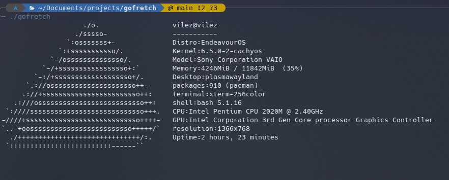
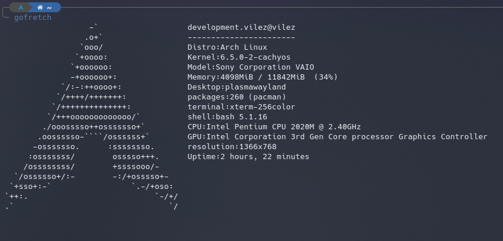

# Gofretch

A neofetch-like tool written in go

## Screenshots



## Usage

1. clone the repository

```bash
git clone https://github.com/Vilez0/gofretch
cd gofretch
```

2. copy the config directory to your ~/.config directory
   or run the following command:

```bash
cp -r config ~/.config/gofretch
```

2. build the binary

```bash
go build
```

3. run the binary

```bash
./gofretch
```

## Configuration

### Info

The lines in the gofretch.conf file that start with info will printed in the output.

The following variables can be used in the config file in the end of the info lines:

- distro : the name of the distribution
- model : the model of your computer
- kernel : the kernel version
- terminal : the terminal you are using
- shell : the shell you are using
- desktop : the desktop environment you are using
- resolution : the resolution of the screen
- packages : the number of packages installed
- uptime : the uptime of the system
- cpu : the cpu model
- cpu_usage : the cpu usage
- gpu : the gpu model
- memory : memory usage, total and usage percentage

Everything else will be printed as is.

for example:

```
info Distro: distro
```

will print your distro name

But

```
info Distro: Arch BTW
```

will print Arch BTW

### Variables

there is only 1 variable, for changing the ascii art


- asciiFile: path/to/ascii/file


_Note:_ if your distro ascii art is not in the ascii directory, you can add it there or change the path to the ascii art file

_Note2:_ if your package manager not detected, you can add it to the packageManagers.json file in the config directory by:

```json
{
  "name": "Your package manager name",
  "path": "/path/to/your/package/manager",
  "params": [
    "Params",
    "That",
    "Should",
    "Print",
    "The",
    "Installed",
    "Packages",
    "List"
  ]
}
```

